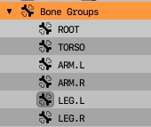
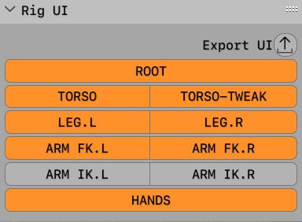
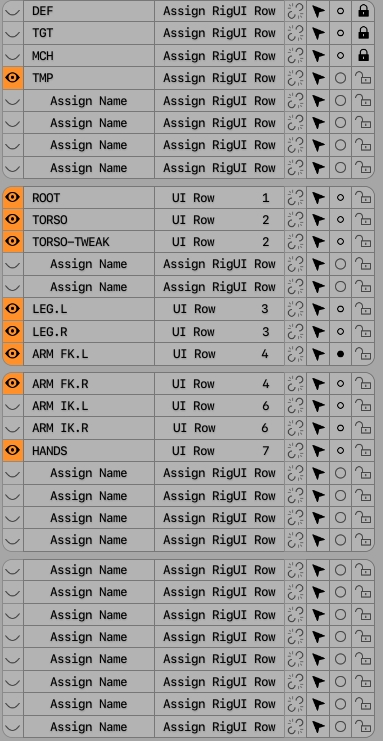

# **General rigging workflow tips**
(Misc information and observations, not related to addon)
___
### **Naming conventions**

Naming convention includes Prefixes such as:

DEF_ DEF. DEF-

TGT. TGT_ TGT-

CTL. CTL_ (alt. CTRL, CON) CTL-

MCH. MCH_  MCH-

IK. IK_ IK-

FK. FK_ FK-

and additional abbreviations include: ORG. ORG_

*Bone types:*

- ROOT (Single main bone to tie the whole armature together)

- Deformation bones (with deform property turned on)

- Target bones (Bones that are constrained to deformation bones via transform constraints)

- Control bones (Bones that are constrained to target bones and control them )

- Mechanism bones (Helper bones that help glue together mechanism of constraints)

- ORG - Original bones from a different armature (might be an exported armature)

WGT - widgets (geometrical custom shapes for selected bones)
___
## **Initial Stages of rigging**

- Create Deformation Armature Bone hierarchy with proper naming convention and prefixes (One side is enough)

- Duplicate The created bone hierarchy rename prefixes of bones from DEF to TGT and get rid of .001 suffix on duplicatd TGT bones, make sure that TGT don't have 'deform' properties

- Assign Copy Transform constraints to DEF bones so that they would copy TGT bones.
  
- Remove all the parenting from DEF bones. TGT Bones retain initial parenting!

- Parent DEF bones to the ROOT bones

#### Bone Groups:

SIMPLE Bone Groups for a rig with no tweak bones:

Simple Rig User Interface for a rig with no tweak bones:

Preferred structure of Bone layers for a simple bipedal rig:

### **Biped rigging tips:**

Leg rigging (Reverse foot rig mechanism)

**Leg naming convention**

DEF layer:

DEF-

DEF-Thigh.L/R

DEF-Shin.L/R