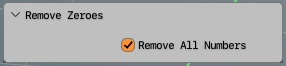

___
# **MeshVoid's Bone Helper Addon For Blender**

## Disclaimer! Currently only version 0.3.0 available which supports only Blender 3.+ versions. I am currently in the process of rewriting this addon to be compatible with 4.0.

## **Installation** | **[Documentation](#DOCUMENATION)** | **DONATE**

### **Installation**

**Download** the zip file of MV Bone Helper from the **releases tab** on github. Go to Blender's **Preferences tab**, open **Addons tab** and click the **install button**. Choose your downloaded zip archive. Enable the addon in Preferences panel.
what the fuck's going on here.
___
## **Use**

Useful for manual rigging and layer-based workflow. It saves time clicking and using batch renaming bones, opening tabs and individually clicking through bone parameters. This addon is designed to be used with Bone Layer Manager addon, as it also sorts bones to appropriate layers, depending on the prefix used.

## **Functions**:
  - Provide consistency in naming convention across all rigs
  - Adds prefixes to bone names and appropriate parameters to bones
  - Automatically sorts bones edited by the addon to appropriate layers
  - Adds side and function suffixes to bone names
  - Sets XYZ rotation euler parameter 
  - Sets deform values depending on the prefix of the bone
  - Selects bones by prefix
  - Adds Root and Property bones

### **Main Bone Groups** identified by a prefix:
  - **Deform** - **Target**
  - **Control**  - **Mechanism**
### **Function bones** identified by a suffix:
  - **IK** - **FK** - **Tweak** - **Switch** - **Pole**
### **Bone sides** identified by a suffix:
  - **Left** - **Right** - **Center**
___

# **DOCUMENTATION**

## **How to use:**

When in **_Armature edit_** or pose modes **_right-click_**(by default) to invoke _Armature Context menu_, scroll down to "**Bone Helper**" button and click it.

MeshVoid Bones Helper Main menu will pop-up:

___

## **ROOT/PROP TAB**

* **_ROOT_**

Creates a **Root bone** in current armature with all the necessary paramenters and placed into the appropriate layer. 

_Note, that a Root bone has a fixed size, so you might have to resize it depending on your setup. Just choose individual origins in Transform Pivot Point options and scale it the way you want it to be._

* **_PROP_**

Creates a **Property bone** in current armature with all the necessary paramenters and placed into the appropriate layer. 

_Note, that a Property bone has a fixed size, so you might have to resize it depending on your setup. Just choose individual origins in Transform Pivot Point options and scale it the way you want it to be._

 * **_Parent->Bone->Root_**

Parent any currently selected bones to Root bone of your armature. You must have a Root bone created in your Armature.
____
## **DEF/TGT TAB**

* #### _**ADD DEF**_

Add Deform bones based on the currently selected bones. Newly added bones will be assigned Deform bone group prefix _**(DEF- by default)**_. **_Deform parameter_** will be toggled _**ON**_, and all the bones will be moved to the appropriate Deform bone layer with appropriate name. (Bone layer assignment works in conjunction with Bone Layer Manager addon, if you don't have one installed, you probably won't notice anything.)

> _NOTE: Whenever you use ADD_BoneGroup function addon duplicates existing bones, assigns appropriate values and removes redundancies in names that appear after the bones were duplicated, use with care._

_**Delete constraints option**_ - Add DEF method has **Delete Constraint** as an option, this will remove all the constraints that have been previously assigned to the bone, so that it wouldn't inherit constraints from the duplicated bones.

* #### _**SET DEF**_

Set Deform bone settings to currently selected bones. Currently selected bones will be assigned Deform bone group prefix, _**Deform parameter**_ will be toggled _**ON**_, and all the bones will be moved to the appropriate Deform bone layer with appropriate name. (Bone layer assignment works in conjunction with Bone Layer Manager addon, if you don't have one installed, you probably won't notice anything.)

* #### _**ADD TGT**_

Add Target bones based on the currently selected bones. Newly added bones will be assigned Target bone group prefix _**(TGT- by default)**_. **_Deform parameter_**  will be toggled **_OFF_**, and all the bones will be moved to the appropriate Target bone layer with appropriate name. (Bone layer assignment works in conjunction with Bone Layer Manager addon, if you don't have one installed, you probably won't notice anything.)

> _NOTE: Whenever you use ADD_BoneGroup function addon duplicates existing bones, assigns appropriate values and removes redundancies in names that appear after the bones were duplicated, use with care._

_**Delete constraints option**_ - Add TGT method has **Delete Constraint** as an option, this will remove all the constraints that have been previously assigned to the bone, so that it wouldn't inherit constraints from the duplicated bones.

* #### _**SET TGT**_

Set Target bone settings to currently selected bones. Currently selected bones will be assigned Target bone group prefix, _**Deform parameter**_ will be toggled _**OFF**_, and all the bones will be moved to the appropriate Target bone layer with appropriate name. (Bone layer assignment works in conjunction with Bone Layer Manager addon, if you don't have one installed, you probably won't notice anything.)

* #### _**DEF->TGT->ROOT**_

Assigns **Copy Transforms Constraint** to selected Deform bones -> Target bones are used as subtargets of the constraint. After **Copy Transforms Constraint** are assigned selected Deform bones will be **parented to the ROOT bone** of the armature, if there is one.

> _NOTE: You will need to select the same number of target bones and deform bones, to avoid inappropriate Copy Transforms Constraint assignment_

* #### _**REMOVE**_

This will just Remove DEF or TGT prefix from the bone, parameters will stay the same though. The bone will stay in the layer it was assigned. To set parameters of other bone group use _SET\_(BONEGROUP)_ function from current or other tabs of addon menu.

_**DEF->TGT->ROOT BUTTON**_
___
## **CTL/MCH TAB**

* #### _**ADD CTL**_

Add Control bones based on the currently selected bones. Newly added bones will be assigned Control bone group prefix _**(CTL- by default)**_. **_Deform parameter_** will be toggled _**OFF**_, and all the bones will be moved to the appropriate Control bone layer with appropriate name. (Bone layer assignment works in conjunction with Bone Layer Manager addon, if you don't have one installed, you probably won't notice anything.)

> _NOTE: Whenever you use ADD_BoneGroup function addon duplicates existing bones, assigns appropriate values and removes redundancies in names that appear after the bones were duplicated, use with care._

_**Delete constraints option**_ - Add CTL method has **Delete Constraint** as an option, this will remove all the constraints that have been previously assigned to the bone, so that it wouldn't inherit constraints from the duplicated bones.

* #### _**SET CTL**_

Set Control bone settings to currently selected bones. Currently selected bones will be assigned Control bone group prefix, _**Deform parameter**_ will be toggled _**OFF**_, and all the bones will be moved to the appropriate Control layer with appropriate name. (Bone layer assignment works in conjunction with Bone Layer Manager addon, if you don't have one installed, you probably won't notice anything.)

* #### _**ADD MCH**_

Add Mechanism bones based on the currently selected bones. Newly added bones will be assigned Mechanism bone group prefix _**(TGT- by default)**_. _Deform parameter_  will be toggled **_OFF_**, and all the bones will be moved to the appropriate Deform layer with appropriate name. (Bone layer assignment works in conjunction with Bone Layer Manager addon, if you don't have one installed, you probably won't notice anything.)

>_NOTE: Whenever you use ADD_BoneGroup function addon duplicates existing bones, assigns appropriate values and removes redundancies in names that appear after the bones were duplicated, use with care._

_**Delete constraints option**_ - Add MCH method has **Delete Constraint** as an option, this will remove all the constraints that have been previously assigned to the bone, so that it wouldn't inherit constraints from the duplicated bones.

* #### _**SET MCH**_

Set Mechanism bone settings to currently selected bones. Currently selected bones will be assigned Mechanism bone group prefix, _**Deform parameter**_ will be toggled _**OFF**_, and all the bones will be moved to the appropriate Deform layer with appropriate name. (Bone layer assignment works in conjunction with Bone Layer Manager addon, if you don't have one installed, you probably won't notice anything.)

* #### _**REMOVE**_

This will just Remove CTL or MCH prefix from the bone, parameters will stay the same though. The bone will stay in the layer it was assigned. To set parameters of other bone group use _SET\_(BONEGROUP)_ function from current or other tabs of addon menu.

## **FUNCTION**

* #### _**IK**_
Assign Inverse Kinematics suffix to currently selected bones. If Left, Right, Center side suffixes has been assigned to the selected bones, Function bone suffix will be assigned **before the side suffix**. Naming conventions would look something like this: 

_**BoneGroupPrefix-Bone_name-Functionsuffix-SideSuffix**_ or **DEF-Bone-IK-L** 

Assigning IK Suffix will move selected bones to separate IK bone layer with appropriate name.
(Bone layer assignment works in conjunction with Bone Layer Manager addon, if you don't have one installed, you probably won't notice anything.)

* #### _**FK**_
Assign Forward Kinematics suffix to currently selected bones. If Left, Right, Center side suffixes has been assigned to the selected bones, Function bone suffix will be assigned **before the side suffix**. Naming conventions would look something like this: 

_**BoneGroupPrefix-Bone_name-Functionsuffix-SideSuffix**_ or **DEF-Bone-FK-L**

Assigning FK Suffix will move selected bones to separate CTL bone layer with appropriate name.
(Bone layer assignment works in conjunction with Bone Layer Manager addon, if you don't have one installed, you probably won't notice anything.)

* #### _**TWEAK**_
Assign Tweak suffix to currently selected bones. If Left, Right, Center side suffixes has been assigned to the selected bones, Function bone suffix will be assigned **before the side suffix**. Naming conventions would look something like this: 

_**BoneGroupPrefix-Bone_name-Functionsuffix-SideSuffix**_ or **DEF-Bone-TWEAK-L**

Assigning Tweak Suffix will move selected bones to separate Tweak bone layer with appropriate name.
(Bone layer assignment works in conjunction with Bone Layer Manager addon, if you don't have one installed, you probably won't notice anything.)

* #### _**SWITCH**_
Assign Switch suffix to currently selected bones. If Left, Right, Center side suffixes has been assigned to the selected bones, Function bone suffix will be assigned **before the side suffix**. Naming conventions would look something like this: 

Assigning Switch Suffix will move selected bones to separate Switch bone layer with appropriate name.
(Bone layer assignment works in conjunction with Bone Layer Manager addon, if you don't have one installed, you probably won't notice anything.)

_**BoneGroupPrefix-Bone_name-Functionsuffix-SideSuffix**_ or **DEF-Bone-SWITCH-L**

* #### _**POLE**_
Assign Pole suffix to currently selected bones. If Left, Right, Center side suffixes has been assigned to the selected bones, Function bone suffix will be assigned **before the side suffix**. Naming conventions would look something like this: 

_**BoneGroupPrefix-Bone_name-Functionsuffix-SideSuffix**_ or **DEF-Bone-POLE-L**

Assigning Pole Suffix will move selected bones to separate Pole bone layer with appropriate name.
(Bone layer assignment works in conjunction with Bone Layer Manager addon, if you don't have one installed, you probably won't notice anything.)

* #### _**REMOVE**_
Remove assigned Function suffix in the bone name. Will remove suffix even if prefixes or the side suffix has been assigned.

## **SIDES**

* #### _**Left**_
Assign Left side suffix to currently selected bones.

* #### _**Right**_
Assign Right side suffix to currently selected bones.

* #### _**Center**_
Assign Center side suffix to currently selected bones.

* #### _**Remove**_
Remove side suffix on currently selected bones. 

## **HIERARCHY**

* #### _**Copy Transforms Hierarchy**_
Assign Copy Transforms constraints to currently selected bones. Constraints will be assigned according to the Bone Group hierarchy, it will follow this structure of assignment: **DEF<-TGT<-MCH<-CTL** 

* #### _**Copy Rotation Hierarchy**_
Assign Copy Rotation constraints to currently selected bones. Constraints will be assigned according to the Bone Group hierarchy, it will follow this structure of assignment: **DEF<-TGT<-MCH<-CTL** 

* #### _**Copy Location Hierarchy**_
Assign Copy Location constraints to currently selected bones. Constraints will be assigned according to the Bone Group hierarchy, it will follow this structure of assignment: **DEF<-TGT<-MCH<-CTL** 

* #### _**Copy Scale Hierarchy**_
Assign Copy Scale constraints to currently selected bones. Constraints will be assigned according to the Bone Group hierarchy, it will follow this structure of assignment: **DEF<-TGT<-MCH<-CTL** 

* #### _**IK Chain**_
Assign Inverse Kinematics Chain constraints to selected bones, that have appropriate naming convention. 

_**Selection conditions**_ to assign the **IK chain** are following:
One **Mechanism bone with IK suffix**, One **Control bone with IK suffix**, One **Control bone with Pole suffix**. Failure to meet any of the conditions will result in cancellation.

An example of Naming convention for successful IK Chain assignment.

_**Chain Length**_ - this option will set the IK chain length, default value is 2.

* #### _**Remove**_
Remove option will delete all constraints assigned to selected bones.

## **SELECT**

Selection Tab is quite basic, all it does is just selects the appropriate bone depending on the presence of certain suffixes in it's name. 
It has options to select all bones by side suffixes: **_Left-Right-Center_**
It has options to select all bones by bone groups: 

_**Deform-Target-Control-Mechanism**_

It has options to select bones by their type: 

_**IK-FK-Tweak-Switch-Pole**_

## **RENAME**

#### _**Remove 0**_ 
By default will _**remove 0**_ in selected bone names, prefixes and suffixes will not be changed.

_**Example**_:

**DEF-Bone.001-L will turn into -> DEF_Bone.1-L**

#### _**Remove All Numbers**_
Remove all digits from the name of the bone if present.

#### _**Enumerate**_
Enumerate selected bone names. Will add a number at the end of the name, it doesn't respect suffixes though, it's just adds a number at the end, so make sure to either use _**Remove**_ function from the _**Suffixes**_ menu tab or anything else.

#### _**Bone->Name**_
The rest of the methods in this panel will replace _**"Bone"**_ string in the name of the selected bones to the one of your choosing.

_**Example:**_ 

**Bone->Spine option, DEF-Bone1-L will transform into-> DEF-Spine1-L**

## **REMOVE GHOSTS**

Sporadically adding and then deleting bones might lead to presence of bone data or custom data "orphans". Press this button that for Blender to enter object mode and delete all non-existent "ghost bones" and names and switch back to bone edit mode.
___
# HOTKEYS
Addon doesn't assign any hotkeys by default, as I believe that it is up to user to customize it's personal hotkeys. It can easily be done by going into **Preferences -> Hotkeys -> 3D View -> Armature** tabs and create a new hotkey.
Name of the operator you should type in is: mvbh_main_menu as shown in this screenshot:

# HOW TO CHANGE NAMING CONVENTION
Currently you can't directly change naming convention of the addon from it's settings panel, this part of the addon is only planned in the development roadmap. But you can tweak the code manually to fit addon for your workflow. To do that, just edit values in the **\_init_** method of the addon in **mvbh_methods.py** file.

**Screenshot:**

# KNOWN ISSUES
There are known issues of the addon that are probably caused by the way addon was written by me. This was my first serious attempt to create a proper addon and a lot of stuff was written and rewritten by me while I was studying Blender Python API. 

* **Root** bone and **Property** bone have fixed sizes and don't respect the scale of the rest of the armature. You will have to rescale them manually.
  
* The whole philosophy of this addon is to be a **helper addon**, and just help you with **manual rigging**, so naturally, it requires you to know what you are actually doing while rigging. If you improperly use addon's functionality, for example add way many bones, start naming them sporadically, start assigning constraints and then deleting bones you might accidentally **shoot yourself in the foot**:
    * You might end up with orphan data in your armature that might cause errors when you use the addon, in that case try exiting Edit or Pose Armature modes and enter Object mode. Try using _**Remove Ghosts**_ button, as it will flush orhan data in your file.

* If you use _**Add_BoneGroup**_ while having bones with selected constraints, be informed that addons duplicates selected bones first, so, naturally, all the constraints that are inherited by the selected bones will remain. To prevent that from happening, choose _**delete constraints**_ option.

# DEVELOPEMENT ROADMAP

## Possible ideas 
- Write logic to one-click add **custom parameters** with drivers for **IK-FK** bone switching based on the selected bones.
- Write logic to one-click assign constraint hierarchy for more complex control rig functionalities like: Foot Roll, More complex IK hierarchy for quadrupedal limbs and etc.
- Write logic to assign bones to appropriate layer.
- Write mvbh_settings.py module that would allow users to tweak addon naming convention and other values directly from preferences panel.

- Modular rig-parts. Add preset parts that would generate limbs, legs and other pre-defined elements.

